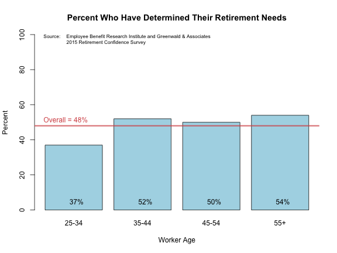

---
title       : Finding Your Crossover Point
subtitle    : 
author      : Jeff Jetton
job         : Developing Data Products Course
framework   : io2012        # {io2012, html5slides, shower, dzslides, ...}
highlighter : highlight.js  # {highlight.js, prettify, highlight}
hitheme     : tomorrow      # 
widgets     : []            # {mathjax, quiz, bootstrap}
mode        : selfcontained # {standalone, draft}
knit        : slidify::knit2slides
--- .class #id

## Financial Independence?

 
 
 

- Will you have to work forever?
- When (if ever) can you afford to retire?
- How much will you need to have saved up by then?
- Is retiring early even <em>possible</em>?

--- .class #id

## Many People Don't Like to Think About It!

In a recent survey, less than half of American workers 25 years or older reported that they (or their spouse) have ever tried to figure out how much money they will need to have saved up in order to live comfortably in retirement. 

 

--- .class #id

## Introducting the Crossover Point

Retirement planning can be complicated. The "Crossover Point", first popularized in the book *Your Money or Your Life* by Vicki Robin and Joe Dominquez, distills the basics down to just a few simple concepts:

1. You have expenses in your life that cost a certain amount
2. Any money you've saved or invested is generating a certain amount of income for you
3. If the value of your investments increase enough, and your expenses don't also increase too much, eventually you'll reach your <strong>Crossover Point</strong>.

As the book puts it:

*At the Crossover Point, where monthly investment income crosses above monthly expenses, you will be financially independent in the traditional sense of that term. You will have a safe, steady income for life from a source other than a job.*

--- .class #id

## Your Next Step

Sounds pretty good, doesn't it? Wouldn't you like to know when *your* Crossover Point may be? 

Well there's a Shiny App for that! Check it out at http://jeffjetton.shinyapps.io/project

 

Some links for further information and inspiration:

 - [Bogleheads](http://www.bogleheads.org/): The best investing forum on the internet
 - [Mr. Money Mustache](http://www.mrmoneymustache.com/): A sometimes-extreme financial independence blog, but worth a read
 - [A Summary of Your Money or Your Life](https://ymoyl.wordpress.com/summary-of-your-money-or-your-life/) (Note that the Shiny app uses a slightly different formula from the one outlined in the book)

